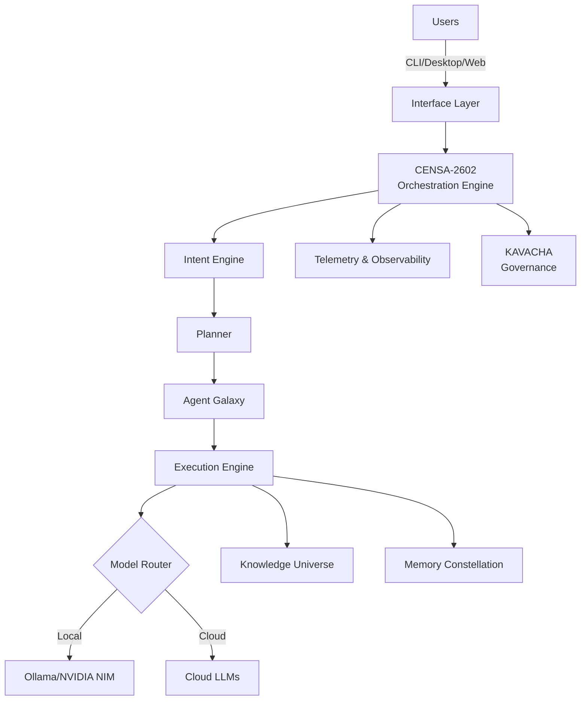

# RE-EVOLVE-ON-HGI

## Hierarchical Intent Governed Intelligence

Building an open ecosystem for trustworthy, modular, and production-ready AI systems through structured intent, governance, and autonomous execution.

---

## What is HGI?

**Hierarchical Intent Governed Intelligence** is an architectural approach where intelligent systems are organized through governed layers of reasoning and execution:

```
Intent → Reasoning → Planning → Memory → Knowledge → Execution → Learning → Human Oversight
```

Instead of isolated AI models, HGI coordinates specialized intelligence through structured decision-making, explicit governance, and continuous feedback. Every action is traceable, explainable, and subject to policy enforcement.

**Core Characteristics:**
- **Intent-Driven** — Requests structured with clear goals and constraints
- **Governed** — All decisions subject to policies, rules, and human oversight
- **Hierarchical** — Multi-layer reasoning from tactical execution to strategic planning
- **Autonomous** — Capable of independent execution within defined boundaries
- **Observable** — Complete auditability and provenance for all operations
- **Learnable** — Continuous improvement through structured feedback loops

---

## What is CENSA-2602?

**CENSA-2602** is the cognitive orchestration engine powering the HGI ecosystem. It handles:

- **Intent Routing** — Classifying and routing requests through the execution hierarchy
- **Agent Orchestration** — Coordinating multi-agent workflows and task decomposition
- **Model Routing** — Intelligent selection of local and cloud models based on intent and constraints
- **Knowledge Integration** — Retrieving and contextualizing information from knowledge systems
- **Memory Management** — Maintaining execution context and learning state
- **Execution Coordination** — Managing parallel and sequential task execution
- **Telemetry & Observability** — Capturing execution metrics and decision provenance
- **Governance Enforcement** — Applying policies and compliance rules to all operations

---

## Core Ecosystem

| Component | Purpose |
|-----------|---------|
| **RE-EVOLVE ON HGI OS** | Intelligence Operating System and core framework |
| **CENSA-2602** | Cognitive orchestration and routing engine |
| **HGI CLI** | AI-native command-line developer interface |
| **Agent Galaxy** | Multi-agent execution framework and runtime |
| **Knowledge Universe** | Long-term knowledge storage and retrieval layer |
| **Memory Constellation** | Context management and memory architecture |
| **Workflow Studio** | Visual automation and orchestration builder |
| **HGI SDK** | Python and JavaScript developer libraries |
| **HGI MCP** | Model Context Protocol ecosystem integrations |
| **HGI Models** | Optimized models for intent reasoning and routing |
| **Plugins** | Community and vendor integrations |
| **KAVACHA** | Security, governance, and compliance layer |

---

## Architecture



---

## Engineering Principles

- **Intent First** — System behavior driven by explicit, structured intent rather than prompts
- **Human Governance** — All autonomous actions subject to human oversight and policy approval
- **Open Standards** — Built on open specifications and community standards
- **Production First** — Every component designed for enterprise deployment
- **Privacy by Design** — Privacy and security embedded from architecture, not bolted on
- **Modular Systems** — Loosely-coupled, independently deployable components
- **Observable Infrastructure** — Complete visibility into system behavior and decision-making
- **Self-Improving Architecture** — Continuous learning and optimization through structured feedback

---

## Repository Philosophy

**Monorepo Today, Modular Tomorrow**

We maintain a monorepo for development velocity and unified versioning. As the ecosystem matures, packages will gradually become standalone repositories while preserving Git history and maintaining compatibility across the ecosystem.

This approach balances:
- Fast development iteration during early phases
- Clear module boundaries and interfaces
- Smooth transition to distributed repositories
- Seamless dependency management

---

## Quick Start

### Prerequisites
- Python 3.10+
- Node.js 18+
- Docker (optional)

### Installation

```bash
# Clone the repository
git clone https://github.com/RE-EVOLVE-ON-HGI/RE-EVOLVE-ON-HGI.git
cd RE-EVOLVE-ON-HGI

# Install dependencies
pip install -r requirements.txt
npm install

# Configure environment
cp .env.example .env
```

### Basic Usage

```python
from hgi import IntentOS, Intent

# Initialize the Intelligence OS
ios = IntentOS()

# Define an intent
intent = Intent(
    goal="Analyze customer sentiment from support tickets",
    constraints=["privacy_compliant", "audit_enabled"],
    reasoning_depth="strategic"
)

# Execute with governance
execution = ios.execute(intent)
result = execution.await_result()
```

---

## Technology Stack

**Languages & Runtime:**
- TypeScript / JavaScript
- Python 3.10+
- Node.js 18+

**Backend & Services:**
- NestJS
- FastAPI
- PostgreSQL
- Redis
- Docker

**Frontend:**
- React
- TanStack Query
- TanStack Router

**AI & Models:**
- LiteLLM
- Ollama
- NVIDIA NIM
- LangChain

**Infrastructure:**
- WebSockets / Socket.IO
- Railway
- Docker Compose

---

## What's Open Source

The RE-EVOLVE-ON-HGI ecosystem is built on open-source foundations:

- **CLI** — Full-featured command-line interface
- **SDK** — Python and JavaScript libraries
- **Models** — Optimized models for intent reasoning
- **Templates** — Pre-built workflow and agent templates
- **Plugins** — Framework and community integrations
- **Documentation** — Comprehensive guides and API references
- **Examples** — Production-ready example implementations
- **Community** — Open contribution process

---

## Contributing

We welcome contributions from developers, researchers, and AI engineers. 

**Ways to Contribute:**
- Report bugs and issues
- Propose new features
- Improve documentation
- Submit pull requests
- Add tests and examples
- Build on the ecosystem (agents, skills, plugins, models)
- Provide feedback on design and architecture

See [CONTRIBUTING.md](./CONTRIBUTING.md) for detailed guidelines.

---

## Community

- **GitHub Issues** — Report bugs and request features
- **GitHub Discussions** — Ask questions and share ideas
- **Pull Requests** — Contribute code and documentation
- **Roadmap** — Track planned work and releases

---

## Roadmap

### Current Phase
- Intelligence OS framework
- CENSA-2602 orchestration engine
- HGI CLI developer tools
- Core governance (KAVACHA)

### Next Phase
- Agent Galaxy multi-agent framework
- Knowledge Universe integration
- Memory Constellation deployment
- Extended security policies

### Future
- Workflow Studio visual builder
- HGI MCP ecosystem
- Enterprise compliance features
- Performance optimization

---

## License

This project is licensed under the MIT License. See [LICENSE](./LICENSE) file for details.

---

## Support

- **Documentation** — [github.com/RE-EVOLVE-ON-HGI](https://github.com/RE-EVOLVE-ON-HGI)
- **GitHub Issues** — Report bugs and feature requests
- **Discussions** — Community questions and ideas

---

**Made with engineering rigor by the RE-EVOLVE Community**
