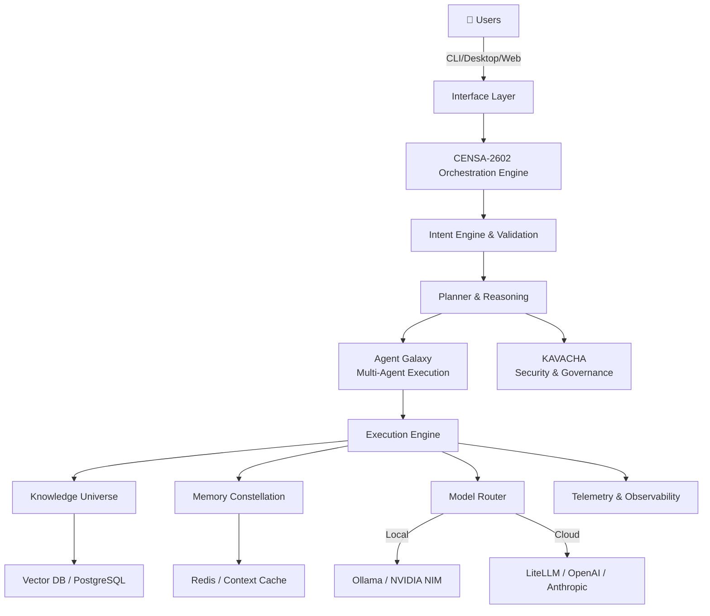

<div align="center">


# RE-EVOLVE ON HGI

**Building trustworthy, modular, production-ready AI systems through Hierarchical Intent Governed Intelligence**

[](https://github.com/RE-EVOLVE-ON-HGI)
[](./LICENSE)
[](https://github.com/RE-EVOLVE-ON-HGI)

</div>

---

## What is HGI?

**Hierarchical Intent Governed Intelligence** is an architectural approach to structuring AI systems where intelligent operations flow through governed layers of reasoning, planning, and execution:

```
Intent → Reasoning → Planning → Memory → Knowledge → Execution → Learning → Oversight
```

Instead of monolithic AI models, HGI coordinates specialized intelligence through structured decision-making, human oversight, and modular governance.

### Core Principles

- **Intent-Driven** — Requests structured with explicit purpose, constraints, and reasoning requirements
- **Governed** — All decisions subject to policies, rules, and human approval where needed
- **Hierarchical** — Multi-layer reasoning from tactical to strategic operations
- **Autonomous** — Independent execution within defined, auditable boundaries
- **Observable** — Complete provenance and telemetry for every decision
- **Modular** — Composable components that evolve independently

---

## What is CENSA-2602?

**CENSA** (Central Intelligence System Architecture) is the orchestration engine powering the HGI ecosystem. It handles:

- **Intent Routing** — Parsing and validating user intents against policies
- **Agent Orchestration** — Coordinating multi-agent workflows and execution
- **Model Routing** — Intelligent dispatch to local and cloud LLMs
- **Knowledge Integration** — Real-time access to structured knowledge and memory
- **Memory Management** — Context preservation and recall across sessions
- **Execution Planning** — Breaking complex goals into executable steps
- **Governance & Compliance** — Policy enforcement and audit logging
- **Telemetry & Observability** — Complete system instrumentation

---

## Core Ecosystem

| Component | Purpose | Status |
|-----------|---------|--------|
| **RE-EVOLVE ON HGI OS** | Intelligence Operating System core | In Development |
| **CENSA-2602** | Cognitive orchestration and routing engine | In Development |
| **HGI CLI** | AI-native command-line developer interface | In Development |
| **Agent Galaxy** | Multi-agent execution framework and coordination | Planned |
| **Knowledge Universe** | Long-term knowledge storage and retrieval layer | Planned |
| **Memory Constellation** | Context management and memory architecture | Planned |
| **Workflow Studio** | Visual automation and orchestration builder | Planned |
| **HGI SDK** | Python and JavaScript developer libraries | In Development |
| **HGI MCP** | Model Context Protocol ecosystem integrations | Planned |
| **HGI Models** | Fine-tuned and specialized models for HGI tasks | Planned |
| **KAVACHA** | Security, governance, and compliance layer | In Development |
| **Plugin Ecosystem** | Community-contributed skills, agents, and models | Planned |

---

## Architecture



---

## Repository Philosophy

**Monorepo Today, Modular Tomorrow**

RE-EVOLVE ON HGI begins as a unified monorepo for rapid iteration and cohesive design. As the ecosystem matures, key components will graduate into standalone, independently-versioned repositories while preserving full Git history through careful extraction. This approach balances:

- **Rapid development** — shared types, unified testing, synchronized releases
- **Clear separation of concerns** — well-defined package boundaries from day one
- **Eventual modularity** — components ready for independent consumption
- **Community contribution** — clear extension points for third-party development

---

## Engineering Principles

1. **Intent First** — System behavior driven by explicit, structured intent with clear constraints
2. **Human Governance** — All autonomous actions subject to human oversight and approval mechanisms
3. **Open Standards** — Built on standard protocols (MCP, OpenAI API, OpenTelemetry)
4. **Production First** — Every component designed for enterprise reliability and scalability
5. **Privacy by Design** — Privacy and security embedded into architecture, not bolted on
6. **Modular Systems** — Loose coupling, high cohesion, independent evolution paths
7. **Observable Infrastructure** — Comprehensive telemetry and auditability from the ground up
8. **Self-Improving Architecture** — Mechanisms for continuous learning and system optimization

---

## Technology Stack

- **Languages:** TypeScript, Python, Go (components)
- **Backend:** NestJS, FastAPI, gRPC
- **Frontend:** React, TanStack Query, Vite
- **Databases:** PostgreSQL (structured), Redis (cache), Vector DB (embeddings)
- **Orchestration:** Docker, Docker Compose, Railway, Kubernetes-ready
- **LLM Integration:** LiteLLM, Ollama, NVIDIA NIM, OpenAI SDK
- **Real-time:** WebSockets, Socket.IO, gRPC Streaming
- **Observability:** OpenTelemetry, structured logging, Prometheus-compatible metrics
- **Testing:** Vitest, pytest, Jest, integration test framework
- **Security:** JWT, OAuth2, RBAC, audit logging

---

## Quick Start

### Prerequisites

- Python 3.10+ or Node.js 18+
- Docker (recommended)
- Git

### Installation

```bash
# Clone the repository
git clone https://github.com/RE-EVOLVE-ON-HGI/RE-EVOLVE-ON-HGI.git
cd RE-EVOLVE-ON-HGI

# Install dependencies
pip install -r requirements.txt
npm install

# Configure environment
cp .env.example .env
```

### Basic Usage

```python
from hgi import IntentOS, Intent, Execution

# Initialize the Intelligence OS
ios = IntentOS()

# Define an intent with constraints
intent = Intent(
    goal="Analyze customer sentiment from support tickets",
    constraints=["privacy_compliant", "audit_enabled"],
    reasoning_depth="strategic"
)

# Execute with governance
execution = ios.execute(intent)
result = execution.await_result()
```

---

## Documentation

- [Architecture Guide](./docs/architecture.md)
- [Intent Specification](./docs/intent-spec.md)
- [CENSA-2602 Orchestration](./docs/censa-orchestration.md)
- [Agent Galaxy Framework](./docs/agent-galaxy.md)
- [Memory Constellation Design](./docs/memory-constellation.md)
- [Knowledge Universe Integration](./docs/knowledge-universe.md)
- [KAVACHA Security & Governance](./docs/kavacha-guide.md)
- [API Reference](./docs/api-reference.md)
- [Contributing Guidelines](./CONTRIBUTING.md)
- [Roadmap](./ROADMAP.md)

---

## Open Source Components

The following are available as open-source under the MIT License:

- **HGI CLI** — Command-line interface for developers
- **HGI SDK** — Python and JavaScript libraries
- **CENSA-2602 Core** — Orchestration engine
- **Model Templates** — Example models and fine-tuning guides
- **Plugin Framework** — Extensibility for skills and agents
- **Documentation** — Complete technical guides and examples
- **Community Contributions** — Plugins, skills, and examples from contributors

---

## Security & Governance (KAVACHA)

All intelligence operations are governed through **KAVACHA**, our security and governance layer:

- **Intent Validation** — All intents verified against policies before execution
- **Execution Sandboxing** — Isolated execution environments with resource limits
- **Audit Logging** — Complete provenance of all decisions and actions
- **Access Control** — Role-based and capability-based access controls
- **Compliance Frameworks** — Built-in support for SOC 2, ISO 27001, and regulatory requirements
- **Data Residency** — Configurable data storage and processing locations
- **Encryption** — End-to-end encryption for sensitive operations
- **Rate Limiting & Quotas** — Prevent resource exhaustion and abuse

---

## Contributing

We welcome contributions from developers, researchers, and AI enthusiasts. See [CONTRIBUTING.md](./CONTRIBUTING.md) for detailed guidelines.

### Ways to Contribute

- **🐛 Bug Reports** — File issues for bugs and unexpected behavior
- **💡 Feature Proposals** — Suggest enhancements and new capabilities
- **📝 Documentation** — Improve guides, examples, and API documentation
- **🔧 Code Contributions** — Submit pull requests for new features or fixes
- **🧪 Tests & Examples** — Add test coverage and real-world examples
- **🚀 Plugins & Skills** — Build community agents, skills, and integrations
- **📊 Models** — Contribute fine-tuned or specialized models

### Development Setup

```bash
# Install development dependencies
npm install --legacy-peer-deps
pip install -r requirements-dev.txt

# Run tests
npm test
pytest

# Start development server
npm run dev
```

---

## Roadmap

### Phase 1: Foundation (Current)
- [ ] Core Intelligence OS framework
- [ ] CENSA-2602 orchestration engine
- [ ] HGI CLI developer tools
- [ ] Basic governance and security (KAVACHA)
- [ ] SDK for Python and JavaScript
- [ ] Complete API documentation

### Phase 2: Ecosystem
- [ ] Agent Galaxy multi-agent framework
- [ ] Knowledge Universe integration
- [ ] Memory Constellation deployment
- [ ] Extended security policies
- [ ] Community plugin framework
- [ ] Public beta release

### Phase 3: Scale
- [ ] Workflow Studio visual builder
- [ ] HGI MCP ecosystem
- [ ] Enterprise compliance features
- [ ] Performance optimization
- [ ] Cloud deployment templates
- [ ] Global ecosystem initiatives

---

## Community

We're building a collaborative community around Hierarchical Intent Governed Intelligence. Get involved:

- **GitHub Issues** — Report bugs and request features
- **GitHub Discussions** — Ask questions and share ideas
- **Pull Requests** — Contribute code and documentation
- **Documentation** — Help improve guides and examples
- **Discord** — Join our community (coming soon)
- **Community Forum** — Deeper discussions (coming soon)

---

## License

This project is licensed under the MIT License. See [LICENSE](./LICENSE) file for details.

---

## Support

- **Documentation** — [Complete guides and API reference](./docs/)
- **GitHub Issues** — [File bugs and request features](https://github.com/RE-EVOLVE-ON-HGI/RE-EVOLVE-ON-HGI/issues)
- **GitHub Discussions** — [Ask questions and share ideas](https://github.com/RE-EVOLVE-ON-HGI/RE-EVOLVE-ON-HGI/discussions)
- **Email** — [Contact us](mailto:contact@re-evolve.ai)

---

## Vision Statement

> Create an open ecosystem where developers, researchers, and organizations can build, extend, and deploy trustworthy AI systems using Hierarchical Intent Governed Intelligence. We believe intelligent systems should be transparent, modular, governed, and accessible to everyone.

---

<div align="center">


### RE-EVOLVE

**Building the Future of Hierarchical Intent Governed Intelligence**

[GitHub](https://github.com/RE-EVOLVE-ON-HGI) • [Documentation](./docs/) • [Issues](https://github.com/RE-EVOLVE-ON-HGI/RE-EVOLVE-ON-HGI/issues) • [Discussions](https://github.com/RE-EVOLVE-ON-HGI/RE-EVOLVE-ON-HGI/discussions)

Made with ❤️ by the RE-EVOLVE Community

</div>